  

  🌷 <i>I like to think that by programming, I can create my own world and share it with everyone!</i> 🌷

<h3 align="center">🌱 my little garden of tools 🌱</h3>

  

  

<h3 align="center">🌸 what I code the most 🌸</h3>

<!--  -->
  

 

💌 thanks for visiting my profile! 💌

